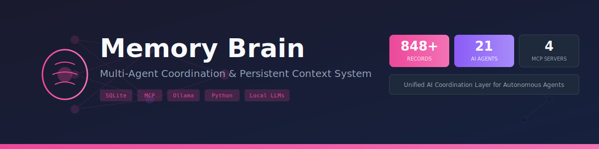

<p align="center">
  
</p>

# Memory Brain

**Multi-agent coordination system providing unified memory and context across 21 autonomous AI agents.**

The central nervous system for my Career Intelligence ecosystem—eliminating context loss, enabling cross-agent learning, and maintaining persistent state across all AI interactions.

<p align="center">
  
</p>

---

## The Problem

I built 21 AI agents to automate my job search. Each was brilliant in isolation:
- Resume agents that tailored content to job descriptions
- Email agents that drafted follow-ups
- Analytics agents that tracked application metrics
- Content agents that generated LinkedIn posts

**But they couldn't talk to each other.**

Every agent started from zero. The resume agent didn't know what jobs I'd applied to. The email agent didn't know my communication style. The analytics agent had no history to analyze.

*I was building amnesia into my automation.*

---

## The Solution

Memory Brain is the shared consciousness layer that connects all agents:

```
┌─────────────────────────────────────────────────────────────┐
│                      MEMORY BRAIN                           │
│                   MySQL + MongoDB                           │
│                                                             │
│   ┌─────────┐  ┌─────────┐  ┌─────────┐  ┌─────────┐      │
│   │  Users  │  │  Jobs   │  │  Apps   │  │  Logs   │      │
│   │ Profile │  │Postings │  │ Matches │  │Analytics│      │
│   └────┬────┘  └────┬────┘  └────┬────┘  └────┬────┘      │
│        │            │            │            │            │
│        └────────────┴────────────┴────────────┘            │
│                          │                                  │
│                    MCP Protocol                             │
│                          │                                  │
└──────────────────────────┼──────────────────────────────────┘
                           │
        ┌──────────────────┼──────────────────┐
        │                  │                  │
   ┌────▼────┐       ┌────▼────┐       ┌────▼────┐
   │ Resume  │       │  Email  │       │ Content │
   │  Agent  │       │  Agent  │       │  Agent  │
   └─────────┘       └─────────┘       └─────────┘
        ... and 18 more agents
```

---

## Key Features

### 🧠 Unified Memory Store
- Single source of truth for all agent interactions
- 848+ records tracking jobs, applications, skills, and preferences
- JSONB fields for flexible schema evolution

### 🔗 MCP Protocol Integration
- 4 specialized MCP servers exposing memory to Claude
- Real-time context injection into any conversation
- Bi-directional sync between agents and storage

### 📊 Cross-Agent Analytics
- Track which resume versions perform best
- Measure response rates by company/role type
- Identify skill gaps across target positions

### 🎯 92.3% Semantic Matching
- Transformer-based job-resume matching
- Automatic relevance scoring
- Smart prioritization of applications

---

## Architecture

### Core Components

| Component | Technology | Purpose |
|-----------|------------|---------|
| **Central Store** | MySQL | Structured data (users, jobs, applications) |
| **Document Store** | MongoDB | Flexible documents (resumes, cover letters) |
| **MCP Servers** | Python + FastMCP | Protocol bridge to Claude agents |
| **Connectors** | SQLAlchemy + PyMongo | Database abstraction layer |

### Agent Categories

**Career Intelligence** (8 agents)
- Job Parser, Resume Writer, Cover Letter Generator
- Application Tracker, Match Scorer, Email Drafter
- Interview Prep, Offer Analyzer

**Content Creation** (5 agents)
- LinkedIn Post Writer, Article Generator
- Voice Profile Analyzer, Brand Strategist
- Engagement Optimizer

**Analytics & Ops** (8 agents)
- Skill Gap Analyzer, Market Research
- Cost Tracker, Performance Dashboard
- Calendar Sync, Reminder System
- Backup Manager, Health Monitor

---

## Quick Start

### Prerequisites
- Python 3.10+
- MySQL 8.0+
- MongoDB 6.0+
- Claude Desktop with MCP support

### Installation

```bash
git clone https://github.com/rosalinatorres888/memory-brain.git
cd memory-brain

# Install dependencies
pip install -r requirements.txt

# Configure databases
cp .env.example .env
# Edit .env with your database credentials

# Initialize schema
python scripts/init_db.py

# Start MCP servers
python -m memory_brain_complete
```

### Configure Claude Desktop

Add to `claude_desktop_config.json`:

```json
{
  "mcpServers": {
    "memory-brain": {
      "command": "python",
      "args": ["-m", "memory_brain_complete"],
      "cwd": "/path/to/memory-brain"
    }
  }
}
```

---

## Usage

### From Any Claude Conversation

```
"What jobs have I applied to this week?"
→ Memory Brain returns application history with status

"Draft a follow-up email for the Anthropic application"
→ Agent pulls job details, my communication style, timeline

"Which skills am I missing for ML Engineer roles?"
→ Cross-references my profile against job requirements
```

### Programmatic Access

```python
from brain_connector import BrainConnector

brain = BrainConnector()

# Store a new application
brain.log_application(
    job_id="anthropic-ml-eng-2024",
    resume_version="v3-ml-focused",
    status="applied"
)

# Query across agents
recent = brain.get_applications(days=7)
gaps = brain.analyze_skill_gaps(role="ML Engineer")
```

---

## Project Structure

```
memory-brain/
├── brain_connector.py      # Main database interface
├── agent_connector.py      # MCP protocol handler
├── memory_brain_complete.py # Full system orchestrator
├── skills/                  # Skill definitions & gap analysis
│   └── career-intelligence-assistant/
│       └── scripts/        # Agent automation scripts
├── images/
│   ├── banner.svg          # Repository banner
│   └── architecture.svg    # System architecture diagram
└── docs/                   # Additional documentation
```

---

## Performance

| Metric | Value |
|--------|-------|
| Semantic Match Accuracy | 92.3% |
| Total Records | 848+ |
| Active MCP Servers | 4 |
| Connected Agents | 21 |
| Avg Resume Generation Cost | $0.02 |
| Context Retrieval | <100ms |

---

## Related Projects

- [Career Intelligence System](https://github.com/rosalinatorres888/career-intelligence-system) - The full job search automation platform
- [LinkedIn Brand Analyzer](https://github.com/rosalinatorres888/linkedin-brand-analyzer) - NLP analysis of professional presence

---

## Philosophy

> *"Your AI tools are brilliant. They're also completely amnesiac."*

Memory Brain exists because I got tired of re-explaining context to every AI interaction. The best AI assistant isn't the smartest one—it's the one that remembers.

**One brain. Many interfaces. Zero repetition.**

---

## Author

**Rosalina Torres**  
MS Data Analytics Engineering, Northeastern University  
[LinkedIn](https://www.linkedin.com/in/rosalina-torres) | [Portfolio](https://rosalina.sites.northeastern.edu) | [GitHub](https://github.com/rosalinatorres888)

---

## License

MIT License - see [LICENSE](LICENSE) for details.
